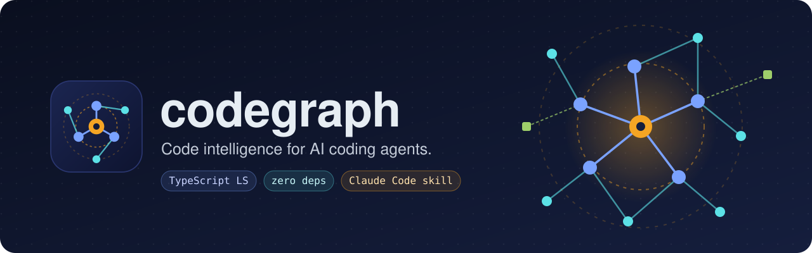

<p align="center">
  
</p>

<p align="center">
  <a href="LICENSE"></a>
  
  
  
  
</p>

# codegraph

**Compiler-accurate code graph tools for AI coding agents working in TypeScript repos.**

codegraph is a [Claude Code](https://claude.com/claude-code) skill with three small scripts.
They answer the questions an agent usually gets wrong with grep:

- **Who calls this?** It finds every reference to a symbol through the TypeScript language
  service, and can follow the callers several levels up.
- **What can this diff break?** It maps your branch's changes to the symbols they touch, then
  lists everything that depends on them, which risk-critical files are involved, which tests
  to run, and which files an auditor should read.
- **Did I just touch money code?** A post-edit hook tells the agent who imports a file the
  moment it edits a file you marked as risk-critical (payments, ledger, auth, settlement).

It uses the `typescript` package already in your `node_modules`. It has no dependencies, no
build step, no LLM calls, no telemetry and no network access. The scripts are plain Node.

---

## Why

Agents edit a function and patch the one call site they happened to open. The breakage lands
in the sibling they never looked at. Text search finds names, not references: it misses
aliased imports and `@/` path aliases, and it can't tell a method on one class from a
same-named method on another.

codegraph asks the compiler instead, and turns the answer into short output an agent can act
on:

- before an edit: a caller tree;
- after a build: one blast-radius report that doubles as the scope for a review.

It is meant to sit next to a hand-written `CLAUDE.md` or `AGENTS.md` map, not to replace one.
The map tells the agent where things live and why. codegraph tells it what a change actually
reaches.

## What it looks like

Take a small repo where `api.ts` calls `OrderService.place`, which calls `credit` in a
money-path file.

```
$ node tools/codegraph/callers.mjs credit -d 3
credit (src/pay/ledger.ts:1, function) -- 3 referencing declarations to depth 3 (1 test, 0 money), 1229ms
src/order.ts:2  OrderService.place
  src/api.ts:2  handler
tests/ledger.test.ts:2  <module>  [test]
```

```
$ node tools/codegraph/blast.mjs --base HEAD -d 2
blast: base HEAD (merge-base 1a76da1b8e) vs working tree, depth 2, 1559ms
=== 1. Changed symbols (1) ===
  src/pay/ledger.ts:1  credit  [money]
=== 2. Impacted symbols (2) ===
-- depth 1 (1)
  src/order.ts:2  OrderService.place  <- credit
-- depth 2 (1)
  src/api.ts:2  handler  <- OrderService.place
=== 3. Money-path hits ===
  !!! MONEY-PATH CHANGED  src/pay/ledger.ts
=== 4. Tests to run (1) ===
  tests/ledger.test.ts  (refs: credit)
=== 5. Audit scope (3 files, money-path first) ===
  [money] src/pay/ledger.ts
  src/api.ts
  src/order.ts
```

After the agent edits `src/pay/ledger.ts`, the hook adds this to its context:

```
MONEY-PATH edit: src/pay/ledger.ts. Imported by 2 files: src/order.ts, tests/ledger.test.ts.
Run node tools/codegraph/blast.mjs before finishing.
```

## Install

### 1. Install the skill (once per machine)

```bash
git clone https://github.com/lum1neuz/codegraph ~/.claude/skills/codegraph
```

Claude Code picks the skill up in the next session. To update it later, run
`git -C ~/.claude/skills/codegraph pull`.

### 2. Add it to a project

Open Claude Code in the repo and say **"install codegraph"**. The agent follows
[SKILL.md](SKILL.md) and does the following:

1. Copies `scripts/` into `tools/codegraph/`.
2. Writes `tools/codegraph/config.json`, which lists your TypeScript projects.
3. Writes `tools/codegraph/moneyPaths.json`, which lists your risk-critical paths. It asks you
   or reads them from your `CLAUDE.md`.
4. Adds `tools/codegraph/.cache/` to `.gitignore`.
5. Registers the hook in `.claude/settings.json`, merging with what is already there.
6. Adds a pointer line to your `CLAUDE.md`.
7. Runs a smoke test.

To install by hand, follow the same steps. The examples in [`templates/`](templates) show both
JSON files.

### Requirements

- Node.js 18 or newer.
- A git repository.
- `typescript` installed in a project's `node_modules` or at the repo root.
- A `tsconfig.json` in each project directory.

## Usage

Run every command from the repo root.

| Question | Command |
|---|---|
| Who calls `X`? | `node tools/codegraph/callers.mjs X` |
| Who calls it, 2 levels up | `node tools/codegraph/callers.mjs X -d 2` |
| Disambiguate a name | `node tools/codegraph/callers.mjs src/a/file.ts:X` |
| A class method | `node tools/codegraph/callers.mjs OrderService.place` |
| What does `X` call? | `node tools/codegraph/callers.mjs X --out callees` |
| What does my branch reach? | `node tools/codegraph/blast.mjs --base origin/main` |
| Only uncommitted work | `node tools/codegraph/blast.mjs --base HEAD -d 1` |
| Paste-ready report for a reviewer | `node tools/codegraph/blast.mjs --md > blast.md` |
| Machine-readable output | add `--json` to either tool |

`blast.mjs` compares the merge-base of `--base` and `HEAD` against your **working tree**, so
uncommitted edits and new untracked files count. Use `--staged` to compare the index instead.

### A suggested agent workflow

1. **Before an edit:** if the symbol is shared or risk-critical, run `callers -d 2`. Treat
   every caller as part of the change.
2. **During the build:** let the hook flag money-path edits. You don't need to stop; carry on.
3. **At the end:** run `blast --md` once. Section 4 lists the tests to run. Section 5 is the
   file list to give a single, fresh-context reviewer.

## Configuration

`tools/codegraph/config.json`:

```json
{
  "projects": {
    "api": { "dir": "backend", "extraRoots": ["tests"] },
    "web": { "dir": "frontend" }
  },
  "schemaFiles": ["backend/prisma/schema.prisma"]
}
```

| Key | Meaning |
|---|---|
| `projects.<name>.dir` | A directory with a `tsconfig.json`. Use `"."` for a single-project repo. For nested directories, the longest match wins. |
| `projects.<name>.extraRoots` | Directories your tsconfig excludes whose references still matter, usually `tests`. |
| `schemaFiles` | Files that aren't TypeScript, such as a Prisma or SQL schema. A change to one is reported as a risk-path change, without symbol analysis. |

`tools/codegraph/moneyPaths.json` is a list of repo-relative globs (`**` crosses directories,
`*` stays within one):

```json
["backend/src/services/payments/**", "backend/src/lib/auth.ts", "backend/prisma/schema.prisma"]
```

Keep it tight. If a glob matches half the repo, the hook is just noise.

## How it works

- **callers / blast:** both build a TypeScript `LanguageService` from each project's
  `tsconfig.json`, so path aliases, `moduleResolution` and project includes behave as `tsc`
  sees them. References come from `findReferences`. Each hit is attributed to its enclosing
  declaration (function, method, class, arrow-function const, or object-literal method), and
  that declaration becomes the next node in the walk. Type-only references are dropped unless
  you pass `--types`. Symbols with more than 40 referencing declarations are summarised as a
  count so that utility hubs don't flood the report.
- **The hook:** it never builds a language service. It keeps an import graph built with
  `ts.preProcessFile` and `ts.resolveModuleName`, cached in `tools/codegraph/.cache/` and
  refreshed by file mtime. It prints nothing for files outside the money paths and never
  blocks an edit.

### Performance

| Operation | Typical time |
|---|---|
| Language service build, per project, per run | ~1 s small repo, 5–15 s for a 400-file app |
| Each query after that | ~0.1 s |
| `blast` on a 500-symbol branch across two projects | ~40 s |
| Hook, warm cache | 0.2–0.7 s |
| Hook, cold cache (first run) | ~1.6 s for ~800 files |

## Limitations

- TypeScript and TSX only.
- Calls through dynamic dispatch, string keys or reflection are invisible. Grep still covers
  those.
- Blast analyses the new tree, so it doesn't report symbols the diff deleted.
- Changes to imports and other top-level module code are listed but not traced further.
- Tests are found by symbol reference, not by import.
- The import cache is invalidated by file mtime, with no content hash. Delete
  `tools/codegraph/.cache/` to rebuild it.

## Repository layout

```
SKILL.md                   instructions Claude Code loads: when to use it, install steps
scripts/
  lib.mjs                  language service, declaration mapping, glob matcher, import graph
  callers.mjs              who calls X / what X calls
  blast.mjs                blast radius of a diff
  postEditHook.mjs         PostToolUse hook
  README.md                per-project reference (copied into tools/codegraph/)
templates/                 example config.json and moneyPaths.json
assets/                    icon and header artwork (SVG)
```

`scripts/` is the canonical copy. Projects get a vendored copy in `tools/codegraph/`. To
update a project, copy the `.mjs` files over; its two config files are never touched.

## Acknowledgements

The callers and blast-radius ideas come from [Graft](https://github.com/trailhq/Graft).
codegraph is a smaller take on them: it leaves out per-prompt context injection, LLM
summaries and cloud sync, and uses the TypeScript compiler instead of tree-sitter.

## License

[MIT](LICENSE) © 2026 lum1neuz
